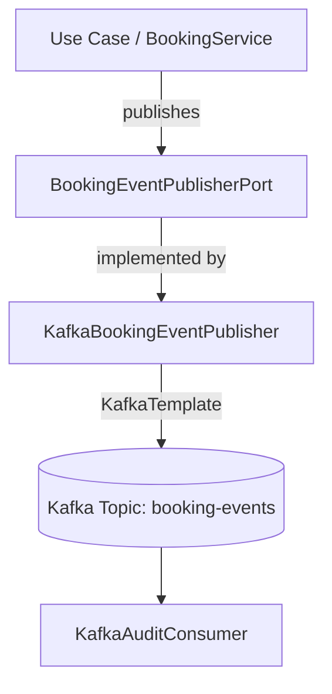

# Integración con Apache Kafka

## Propósito

El proyecto utiliza Apache Kafka como mecanismo para publicar **eventos de negocio persistentes** relacionados con las reservas y pagos (ej. `BookingCreated`, `BookingCancelled`). Estos eventos están orientados a:
- Auditoría
- Analytics
- Futuros consumidores (sistemas externos o microservicios)

## Diferencia con RabbitMQ

Es importante entender la diferencia entre las dos tecnologías de mensajería utilizadas en el proyecto:

- **RabbitMQ**: Se utiliza para el **procesamiento asíncrono de tareas y notificaciones**. Es decir, mensajes transitorios (comandos o notificaciones push) que una vez procesados, se eliminan.
- **Kafka**: Se utiliza para la **emisión de eventos de negocio persistentes**. Los eventos en Kafka permanecen en los topics y pueden ser consumidos independientemente por múltiples consumidores en cualquier momento, permitiendo recrear el estado o auditar los flujos.

## Arquitectura

La integración sigue la arquitectura hexagonal del proyecto, garantizando que el dominio y los casos de uso no dependan de la infraestructura de Kafka.



## Eventos de Negocio

Todos los eventos publicados comparten un mismo envelope o contenedor común (`BusinessEvent`), el cual cuenta con los siguientes atributos:
- `eventId`: Identificador único del evento.
- `eventType`: Tipo de evento (ej. "BookingCreated").
- `aggregateId`: Identificador de la entidad o agregado (ej. bookingId).
- `aggregateType`: Tipo de agregado (ej. "Booking").
- `occurredAt`: Fecha y hora de ocurrencia.
- `correlationId`: Identificador de correlación para trazar la solicitud desde el controlador.
- `version`: Versión del esquema del evento.
- `payload`: Detalles específicos del evento.

### Eventos Soportados

1. **BookingCreated**
   - **Propósito**: Notificar la creación de una nueva reserva.
   - **Aggregate**: Booking
   - **Payload**: `bookingId`, `offeringId`, `customerId`, `scheduledAt`, `status`.

2. **BookingCancelled**
   - **Propósito**: Notificar la cancelación de una reserva.
   - **Aggregate**: Booking
   - **Payload**: `bookingId`, `customerId`, `status`.

*(Nota: Los eventos `PaymentApproved` y `PaymentRejected` tienen sus estructuras listas para ser integradas en futuras funcionalidades de pagos).*

## Configuración y Variables de Entorno

- `KAFKA_BOOTSTRAP_SERVERS`: Direcciones de los brokers de Kafka (por defecto `localhost:9092` en local o `kafka:29092` en Docker).
- `KAFKA_TOPIC_BOOKING_EVENTS`: Nombre del topic para los eventos de reserva (por defecto `booking-events`).
- `KAFKA_CONSUMER_GROUP`: Identificador del consumer group de auditoría (por defecto `skillbridge-audit-group`).

## Ejecución Local

Para probar Kafka de forma local utilizando Docker Compose, sigue los siguientes pasos:

1. **Levantar la infraestructura**:
   ```bash
   docker-compose up -d
   ```
   Esto levantará Postgres, Redis, RabbitMQ y **Kafka**.

2. **Iniciar el backend**:
   Ejecuta la aplicación de Spring Boot (ej. mediante tu IDE o con Maven). Asegúrate de tener las variables de entorno configuradas si ejecutas fuera de Docker.

3. **Crear una reserva**:
   Realiza una petición POST a `/api/bookings` o a través del frontend para crear una reserva.

4. **Verificar la emisión del evento**:
   Revisa los logs del backend. Deberías observar los logs del Publisher y del Consumer:
   ```text
   INFO: Publicando evento en Kafka - eventId: ..., eventType: BookingCreated, aggregateId: ..., correlationId: ...
   INFO: Evento publicado exitosamente en el topic booking-events: ...
   INFO: 🔔 [AUDIT KAFKA CONSUMER] Evento de negocio recibido:
   INFO:    -> Event ID: ...
   INFO:    -> Event Type: BookingCreated
   INFO:    -> Aggregate ID: ...
   INFO:    -> Correlation ID: ...
   INFO:    -> Payload: BookingCreatedPayload[...]
   ```

Con estos pasos demuestras que el flujo completo (Producer -> Topic -> Consumer) funciona correctamente, además de que RabbitMQ sigue procesando las notificaciones en paralelo sin interferencias.
