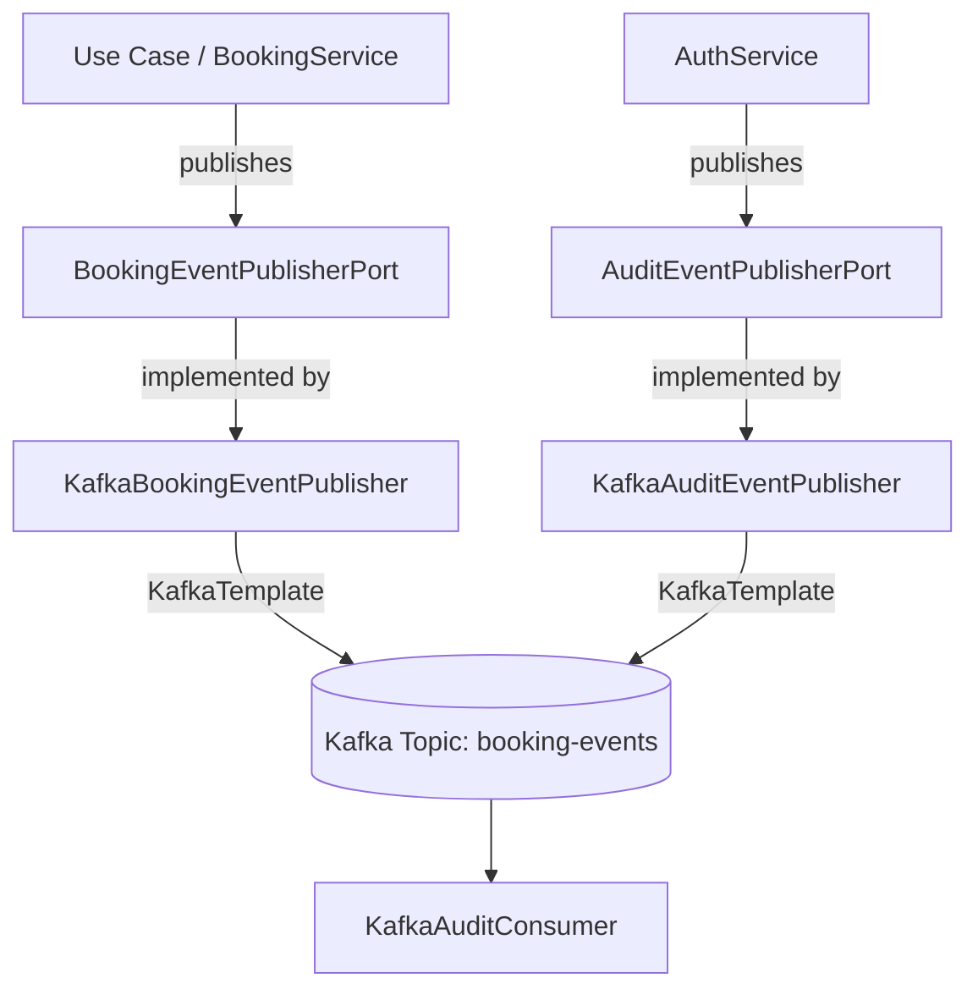

# Integración con Apache Kafka

## Propósito

El proyecto utiliza Apache Kafka como mecanismo para publicar **eventos de negocio persistentes** relacionados con las reservas y pagos (ej. `BookingCreated`, `BookingCancelled`), así como **eventos de auditoría** (ej. `UserLoggedIn`, `UserRegistered`, `OfferingCreated`). Estos eventos están orientados a:
- Auditoría
- Analytics
- Futuros consumidores (sistemas externos o microservicios)

## Diferencia con RabbitMQ

Es importante entender la diferencia entre las dos tecnologías de mensajería utilizadas en el proyecto:

- **RabbitMQ**: Se utiliza para el **procesamiento asíncrono de tareas y notificaciones**. Es decir, mensajes transitorios (comandos o notificaciones push) que una vez procesados, se eliminan.
- **Kafka**: Se utiliza para la **emisión de eventos de negocio persistentes y auditoría**. Los eventos en Kafka permanecen en los topics y pueden ser consumidos independientemente por múltiples consumidores en cualquier momento, permitiendo recrear el estado o auditar los flujos.

## Arquitectura

La integración sigue la arquitectura hexagonal del proyecto, garantizando que el dominio y los casos de uso no dependan de la infraestructura de Kafka.



## Nota sobre Topics: booking-events vs audit-events
Inicialmente se recomendó separar los eventos en `booking-events` y `audit-events`. Sin embargo, **se ha determinado que esta separación rompe la implementación existente** del `audit-service`, ya que el consumidor (`KafkaAuditConsumer`) actualmente está hardcodeado para escuchar únicamente al topic `booking-events` y existen restricciones que prohíben modificar su código fuente o su despliegue en Docker.

Como alternativa, se ha unificado la emisión de todos los eventos (tanto de negocio como de auditoría) hacia el topic `booking-events` garantizando que lleguen íntegramente al `audit-service` y sean visibles en el frontend.

## Eventos de Negocio y Auditoría

Todos los eventos publicados comparten un mismo envelope o contenedor común (`BusinessEvent`), el cual cuenta con los siguientes atributos:
- `eventId`: Identificador único del evento.
- `eventType`: Tipo de evento (ej. "BookingCreated").
- `aggregateId`: Identificador de la entidad o agregado (ej. bookingId).
- `aggregateType`: Tipo de agregado (ej. "Booking").
- `occurredAt`: Fecha y hora de ocurrencia.
- `correlationId`: Identificador de correlación para trazar la solicitud desde el controlador.
- `version`: Versión del esquema del evento.
- `payload`: Detalles específicos del evento.

**Nuevos campos de Auditoría agregados:**
Para brindar trazabilidad detallada, los eventos ahora viajan enriquecidos con la siguiente información en la raíz del evento y redundante dentro del objeto `payload` (para garantizar compatibilidad con la deserialización estricta del `audit-service` que ignora campos nuevos en la raíz):
- `actorUserId`: El ID del usuario que originó o ejecutó la acción.
- `actorUsername`: El username (o email) del actor.
- `actorRole`: El rol que tenía el actor en ese momento.
- `action`: La operación ejecutada (ej. `CREATE`, `UPDATE`, `LOGIN`, `CANCEL`).
- `resource`: El tipo de recurso afectado (ej. `BOOKING`, `USER`, `OFFERING`).
- `resourceId`: El ID del recurso específico que fue alterado o al cual se accedió.

### Eventos Soportados

1. **BookingCreated** (en `booking-events`)
   - **Propósito**: Notificar la creación de una nueva reserva.
   - **Payload**: `bookingId`, `offeringId`, `customerId`, `scheduledAt`, `status`.
   - **Auditoría**: action=CREATE, resource=BOOKING, resourceId=bookingId

2. **BookingCancelled** (en `booking-events`)
   - **Propósito**: Notificar la cancelación de una reserva.
   - **Payload**: `bookingId`, `customerId`, `status`.
   - **Auditoría**: action=CANCEL, resource=BOOKING, resourceId=bookingId

3. **UserLoggedIn** (en `booking-events`)
   - **Propósito**: Notificar el inicio de sesión exitoso de un usuario.
   - **Auditoría**: action=LOGIN, resource=USER, resourceId=userId

4. **UserRegistered** (en `booking-events`)
   - **Propósito**: Notificar el registro de un nuevo usuario en el sistema.
   - **Auditoría**: action=REGISTER, resource=USER, resourceId=newUserId

5. **Eventos Administrativos (Offerings)** (en `booking-events`)
   - `OfferingCreated`, `OfferingUpdated`, `OfferingActivated`, `OfferingDeactivated`.
   - **Auditoría**: action acorde (CREATE/UPDATE/ACTIVATE/DEACTIVATE), resource=OFFERING, resourceId=offeringId.

## Configuración y Variables de Entorno

- `KAFKA_BOOTSTRAP_SERVERS`: Direcciones de los brokers de Kafka.
- `KAFKA_TOPIC_BOOKING_EVENTS`: Nombre del topic para los eventos de reserva (por defecto `booking-events`).
- `KAFKA_TOPIC_AUDIT_EVENTS`: Por compatibilidad se iguala a `booking-events`.
- `KAFKA_CONSUMER_GROUP`: Identificador del consumer group de auditoría (por defecto `skillbridge-audit-group`).

## Ejecución Local

Para probar Kafka de forma local utilizando Docker Compose, sigue los siguientes pasos:

1. **Levantar la infraestructura**:
   ```bash
   docker-compose up -d
   ```
   Esto levantará Postgres, Redis, RabbitMQ y **Kafka**.

2. **Iniciar el backend**:
   Ejecuta la aplicación de Spring Boot (ej. mediante tu IDE o con Maven). Asegúrate de tener las variables de entorno configuradas si ejecutas fuera de Docker.

3. **Crear una reserva o Login**:
   Realiza una petición POST a `/api/bookings` o a través del frontend para crear una reserva, o inicia sesión.

4. **Verificar la emisión del evento**:
   Revisa los logs del backend. Deberías observar los logs del Publisher y del Consumer:
   ```text
   INFO: Publicando evento en Kafka - eventId: ..., eventType: BookingCreated, aggregateId: ..., correlationId: ...
   INFO: Evento publicado exitosamente en el topic booking-events: ...
   ```
